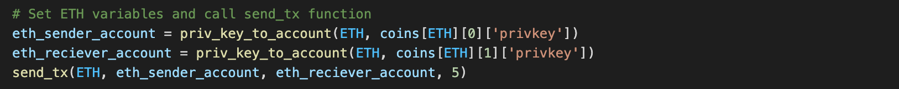
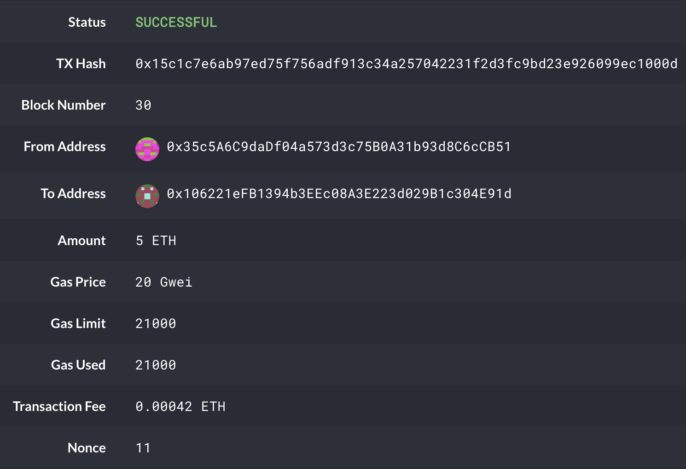

# Multi-Blockchain Wallet in Python

The following code uses a command line tool called hd-wallet-derive to create an HD wallet for Ethereum and Bitcoin Testnet.  Python then uses bit and web3 to create and send transactions over both networks. 

---

## Technologies

Language: Python, PHP

Programs: bit, web3

Developed with Visual Studio

---

## Installation

**HD Wallet Derive** - [Install HD Wallet Derive](https://github.com/dan-da/hd-wallet-derive)
- Install [Homebrew](https://brew.sh/) 
- Use the following command to update PHP to the full version:

- Execute the following command if using a zsh shell:

*Note: if using bash shell change .zshrc to .bash_profile*
- Verify the correct version of PHP was installed
- Clone and install HD Wallet Derive from the link above and using the following commands:

**Go Ethereum** - [Install Go Ethereum](https://geth.ethereum.org/downloads/)
- *Please refer to [Testnet Documentation](Resources/testnet-documentation.pdf) to set up the Ethereum blockchain*

**MyCrypto** - [Install MyCrypto](https://download.mycrypto.com/)

---

## Instructions

**Ethereum:** 
- Add one of the ETH addresses to the pre-allocated accounts in the config json file from the Ethereum testnet you setup previously

- Delete the geth folder in each node, then reinitialize using the command below. This will create a new chain and will prefund the account

- Since the w3.eth.generateGasPrice() function does not work with an empty chain, you must send a couple transactions using MyCrypto first. Print the coins dictionary and use an ETH address privkey to access the wallet in MyCrypto (*note: do not share your private key*)

- Run the code to send an ETH transaction

- Find the transaction ID 

- Open MyCrypto and check the transaction was successful

**Bitcoin Testnet:**
- Fund one of the BTCTEST addresses found in the coins dictionary using [this testnet faucet](https://testnet-faucet.mempool.co/)

- Run the code to send a BTCTEST transaction

- Enter the BTCTEST address into a [block explorer](https://tbtc.bitaps.com/) to watch the transaction

---

## Contributors

Drew Disbrow Marnell: dldmarnell@gmail.com

---

## License

MIT License
Copyright (c) 2021 Drew Disbrow Marnell